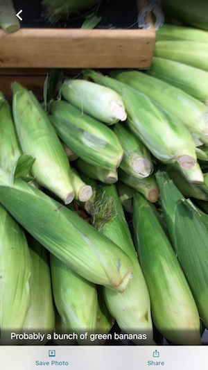
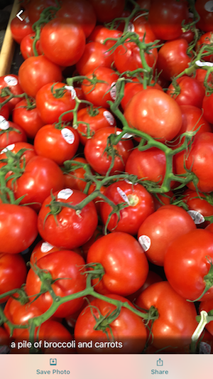
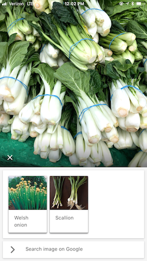
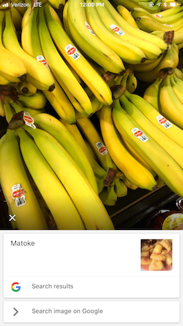

# Seeing the World

> ***If an autonomous vehicle can drive itself, I strongly believe we can enable people who are blind or have low vision to see and navigate the world with ease.***


Enabling people who are blind or have low vision to see and navigate the world with ease is the main goal of this AI for Mankind's **Seeing the World** open source project. We want to leverage the power of open source community to build low cost open source image recognition and object detection models to empower people who are blind or have low vision to see and navigate the world. All the models built will be freely available to all across the entire world.

According to WHO, there are 253 million people live with vision impairment. 217 million have moderate to severe vision impairment and 36 million are blind. 81% of people who are blind or have moderate or severe vision impairment are aged 50 years and above.

### List of Projects

#### Image Recognition
- Fruit/Vegetable in Farmers' Market/Grocery Store

As a baby step, we will start with building model to recognize fruit and vegetable in Farmers' Market/grocery store and expand to other settings. We will contribute back all the models back to Microsoft Seeing AI [Microsoft's Seeing AI app](https://www.microsoft.com/en-us/seeing-ai)

We encourage our members and public to take pictures of different fruit and vegetable whenever they go to Farmer Market and commit back to the repo. We will build model using these pictures.

Even though Microsoft's Seeing AI mobile app is very powerful but its fruit/vegetable recognition skill still needs improvement. 

See some misclassifications of fruit/vegetable using Microsoft Seeing AI app. 

|              |             |
:-------------------------:|:-------------------------:
  |  


See some misclassifications of fruit/vegetable using Google Lens app. 

|              |             |
:-------------------------:|:-------------------------:
  |  


We want to help improve Microsoft Seeing AI's fruit/vegetable recognition capability by curating training dataset of fruit/vegetable across the entire world. Crowdsourcing of this dataset from across the world is important so that it will capture different variety of local fruits/vegetables across geography.


#### Object Detection
- Outdoor Space Object Detection
    - Farmers' Market
    - Grocery Store
- Indoor Space Object Detection

#### Quick Start

**Building Fruit/Vegetable Model via Transfer Learning**

Install Docker:

https://docs.docker.com/v17.12/docker-for-mac/install/#install-and-run-docker-for-mac

We use the scripts provided by the following excellent Google’s TensorFlow For Poets codelab.
https://codelabs.developers.google.com/codelabs/tensorflow-for-poets/#0

Increase the memory available to Docker Engine
1. Navigate to Docker Preferences
2. Select Advanced
3. Increase Memory to 4.0 GiB

Clone the repository (https://github.com/aiformankind/seeing-the-world.git):
```
git clone https://github.com/aiformankind/seeing-the-world.git
```

Go to the repository directory that you just clone:
```
cd seeing-the-world
```

Build the Tensorflow docker (this job will pull the latest tensorflow images and set up the environment) :
```
docker build -t aiformankind/seeingtheworld:0.0.1 .
```

Start the Tensorflow container (this job will spin up the seetheworld container):
```
docker run -it -p 8888:8888 -p 6006:6006 --name=seeingtheworld aiformankind/seeingtheworld:0.0.1
```

Augment data:
```
python augment/augment_images.py --image_dir=data/usa/farmer_market --num_samples=9000
```

Retrain model:
```
python -m train.retrain   --bottleneck_dir=train_output/bottlenecks   --how_many_training_steps=500   --model_dir=train_output/models/   --summaries_dir=train_output/training_summaries/"${ARCHITECTURE}"   --output_graph=train_output/retrained_graph.pb   --output_labels=train_output/retrained_labels.txt   --architecture="${ARCHITECTURE}" --image_dir=augment-data/usa/farmer_market
```

Predict label:
```
python -m train.label_image --graph=train_output/retrained_graph.pb --image=validation/usa/farmer_market/tomato/tomato-val-1.jpg
```

#### Upload Pictures
You can use one of the following methods to upload your fruit and vegetatble pictures to us. All uploaded pictures are automatically considered as public domain data and made freely available to anyone to use. Uploaded pictures are stored in our git repo for others to use. You acknowledge and agree to all the above by uploading your pictures.

1. Create a Pull Request via Git
2. Share your images with us (ai.for.mankind@gmail.com) via Google Photos. 
3. Share your images via Instagram by using hashtag #FruitsVegChallenge and  #AI_<FRUIT_TYPE>, an AI prefix hashtag eg: #AI_carrot, #AI_cauliflower. Remember to tag aiformankind. [More infos about our Instagram #FruitsVegChallenge](https://www.instagram.com/p/Bp8vjuaADBi/) 

#### Apps for people who are blind or have vision impairment
- [Seeing AI from Microsoft](https://www.microsoft.com/en-us/ai/seeing-ai)
- [Lookout from Google](https://www.blog.google/outreach-initiatives/accessibility/lookout-discover-your-surroundings-help-ai/)
- [aira](https://aira.io/)


#### Roadmap
1) Collect fruit/vegetable pics across entire world
2) Build a crowdsourcing mobile app

#### Project Advisors:
Jigar Doshi from CrowdAI, [@jigarkdoshi](https://twitter.com/jigarkdoshi)

#### Troubleshooting

* Problem: The **Augment data** step fails with error 'Killed'. Resolution: Increase memory allocated to Docker Engine and rerun.